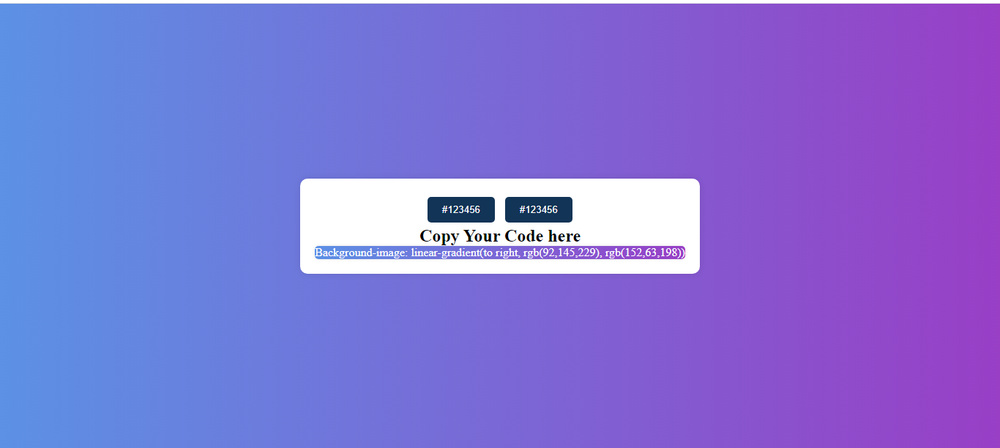

# Color-Gradient-Project
Color-Gradient is a JavaScript project that allows users to generate beautiful color gradients dynamically. With Color-Gradient, you can easily create custom color gradients to use in your web projects, designs, or applications.

